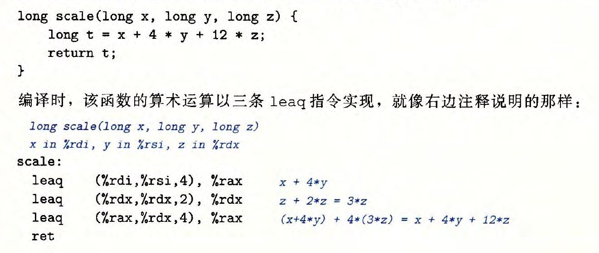

# 第1章 计算机系统综述

0或1组成位（比特）序列，8个位为一组称为字节。计算机系统使用 ASCII 标准表示文本字符，计算机中只由 ASCII 构成的文件为文本文件，其他均为二进制文件。

GCC 编译器驱动程序运行经历4个步骤：

- 预处理阶段：根据头文件插入相应内容（拓展名：.c）
- 编译阶段：将程序语言翻译为通用的汇编语言（拓展名：.s）
- 汇编阶段：将汇编转换为机器语言，也即指令代码（人看不懂）（拓展名：.o）
- 链接阶段：根据程序中的函数链接预编译的目标文件，组合形成可执行目标文件（目标程序）

为什么需要知道编译系统怎么工作的呢？

- 优化程序性能。实现同一功能的不同语句可能效力不同。
- 理解链接时出现的错误。
- 避免安全漏洞。缓存溢出错误等……

因为要理解程序运行过程，所以需要了解计算机硬件组织结构。

进程是一种抽象概念，是操作系统对一个正在运行的程序的抽象。并发运行，指的是一个进程和另一个进程的指令交叉执行。

多个线程作为执行单元组成一个进程。

操作系统作为程序与硬件之间的媒介，提供三种抽象：

- 文件是对 I/O 设备的抽象
- 虚拟内存是对主存和磁盘的抽象
- 进程是对处理器、主存和 I/O 设备的抽象

# 第2章 信息的表示与处理

## 2.1 信息存储

计算机将一个字节（8位的块）作为最小的可寻址的内存单元，并不访问单独的位。

内存被视为一个非常大的字节数组，称为**虚拟内存**。

内存中每个字节都由唯一的数字标识，称为**地址**，所有地址集合称为**虚拟地址空间**。

### 2.1.2 字数据大小

对于一个字长为 w 位的机器，虚拟地址范围为0~2^w^ -1，最多可访问 2^w^ 个字节。

将程序称为“32位程序”或“64位程序”，区别在于程序是如何编译的。

### 2.1.3 寻址和字节顺序

多字节对象被存储为连续的字节序列，对象的地址为所使用字节中最小的地址。

排列一个对象的字节有两种通用规则：

- 小端法——从最低有效字节到最高有效字节顺序存储
- 大端法——从最高有效字节到最低有效字节顺序存储

由于存在两种字节排列方法，可能存在三种问题：

- 当小端机器发送数据到大端机器时，字里的字节会变成反序。因此需要一套通用的网络标准在各自传送接受时进行转换。

  ```
  💡 这样一套网络字节序一般是大端序
  ```

- 字节顺序对阅读整数数据的字节序列重要。
- 强制类型转换

### 2.1.9 C 语言中的移位运算

移位运算有算术移位和逻辑移位两种类型，一般来说，几乎所有编译器对于有符号数使用算术右移；而对于无符号数，右移必须是逻辑的。

- 算术右移：在左端补 k 个最高有效位的值
- 逻辑右移：在左端补 k 个0

## 2.2 整数表示


利用补码表示有符号整数，可以理解能表示的整数比负数少一个（0作为非负数，只用一种方式表示）

```
💡 补码与原码转换：正整数补码与原码相同；负整数的原码，除符号位全部取反，然后+1，得到补码。
```


### 2.2.4 有符号数和无符号数之间的转换

（unsigned）将有符号数强制转化为无符号数：对于这两种形式下都能表示的值，保持不变；若将负数转化为无符号数可能得到0；如果转化的无符号数太大以至超出补码的范围，可能得到 T~max~。

强制类型转换的结果保持位值不变，只是改变解释这些位的方式。

```c
short int v = -12345;
unsigned short uv = (unsigned short) v;
printf("v = %d, uv = %u\n", v, uv);

//产生输出
//u = -12345, uv = 53191
//-12345的16位补码表示和53191的16位无符号表示完全一致
```

```c
unsigned u = 4294967295u;
int tu = (int) u;
printf("u = %u, tu = %d\n", u, tu);

//产生输出
//u = 4294967295， tu = -1
//无符号形式的4294967295和补码形式的-1 的位模式完全一致
```

### 2.2.5 C 语言中的有符号数与无符号数

C 语言中声名常量时，默认为有符号的，需要创建无符号常量时，必须加上后缀字符 “U”或者“u”。

```
💡 使用 printf 输出数值，分别使用指示符 %d，%u，%x以有符号十进制、无符号十进制、十六进制格式输出。
```

### 2.2.6 扩展一个数字的位表示

### 2.2.7 截断数字

## 2.3 整数运算

```
💡 如何理解比较表达式 x<y 和比较表达式 x-y<0 会产生不同结果
```

### 2.3.1 无符号加法


溢出情况下，和的结果增加位数，且最高位是1，如果丢弃最高位，自然就是减去 2^w^ 的结果。

### 2.3.2 补码加法


计算机进行是“整数”运算实际是一种模运算模式，表示数字的有限字长限制了可能的取值范围

## 2.4 浮点数


# 第3章 程序的机器级表示（汇编代码）

## 3.2 程序编码

## 3.3 数据格式

C 语言数据类型在x86-64中的大小：


## 3.4 访问信息

一个x86-64 的中央处理单元(CPU) 包含一组16 个存储64 位值的 **通用目的寄存器**.


### 3.4.1 操作数指令符

大多数指令有一个或多个操作数(operand), 指示出执行一个操作中要使用的源数据值，以及放置结果的目的位置。

操作数类型：

1. 立即数：表示常数值，比如， $-577 或$0x1F
2. 寄存器：表示某个寄存器的内容， 16 个寄存器的低位1 字节、2 字节、4 字节或8 字节中的一个作为操作数，这些字节数分别对应于8 位、16 位、32 位或64 位。
3. 内存引用：根据计算出来的地址（通常称为有效地址）访问某个内存位置。

### 3.4.2 数据传送指令（将数据从一个位置复制到另一个位置的指令）

最简单形式的数据传送指令-MOV 类。

MOV 类由四条指令组成： movb 、movw 、movl 和 movq 。这些指令都执行同样的操作；主要区别在于它们操作的数据大小不同：分别是1、2 、4 和8 字节。

源操作数指定的值是一个立即数，存储在寄存器中或者内存中。目的操作数指定一个位置，要么是一个寄存器或者，要么是一个内存地址。

```
💡 x86-64 加了一条限制，传送指令的两个操作数不能都指向内存位置。
```

局部变量通常保存在寄存器中

### 3.4.4 压入和弹出栈数据


pushq 指令的功能是把数据压入到栈上，而popq 指令是弹出数据。这些指令都只有一个操作数一一压入的数据源和弹出的数据目的。

将一个四字值压人栈中，首先要将栈指针减8, 然后将值写到新的栈顶地址。


弹出一个四字的操作包括从栈顶位置读出数据，然后将栈指针加8 。


## 3.5 算术和逻辑操作

这些操作分为四组：：加载有效地址、一元操作、二元操作和移位。

### 3.5.1 加载有效地址(leap)



## 未完待续 


# 第5章 优化程序性能

编译器如GCC在对程序进行优化时，会考虑各种情况也包括最坏的情况（像是两指针指向同一地址的情况），这也就限制了编译器的可能的优化策略。


***


# 第7章 链接

## 7.1 编译器驱动程序

程序编译的过程：预处理->编译->汇编->链接

```c
int sum (int *a, int n);
int array[2] = {1, 2};

int main()
{
    int val = sum(array, 2);
    return val;
}
```

```c
int sum (int *a, int n)
{
    int i, s=0;
    for(i = 0; i < n; i++){
        s + = a[i];
    }
    return s;
}
```

在shell中调用GCC驱动程序编译构造以上代码 `linux> gcc -Og -o prog main.c sum.c`

## 7.2 静态链接

链接器完成两项任务：符号解析，重定位。

